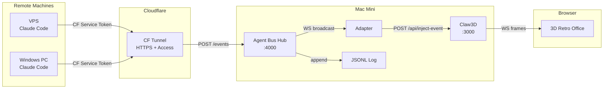
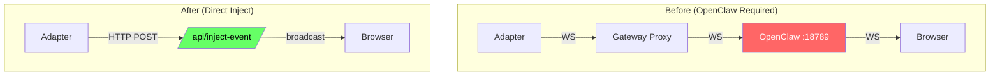
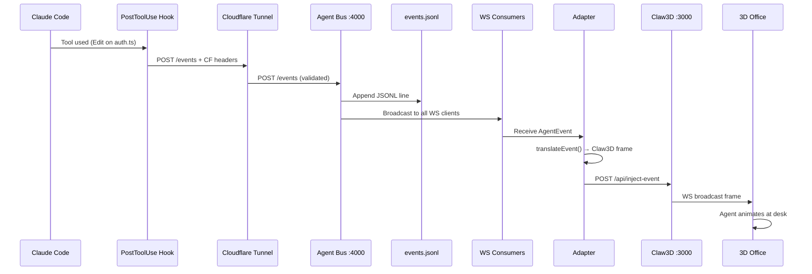
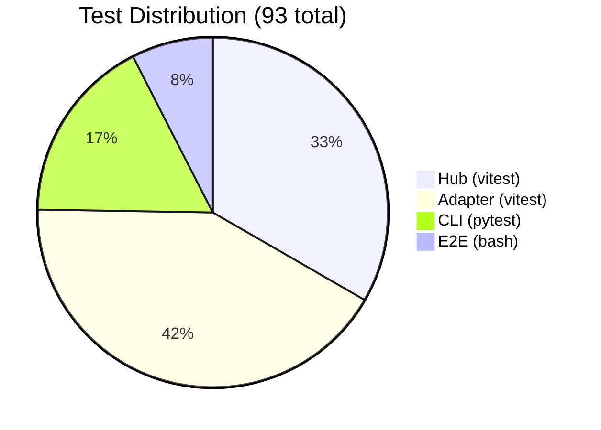
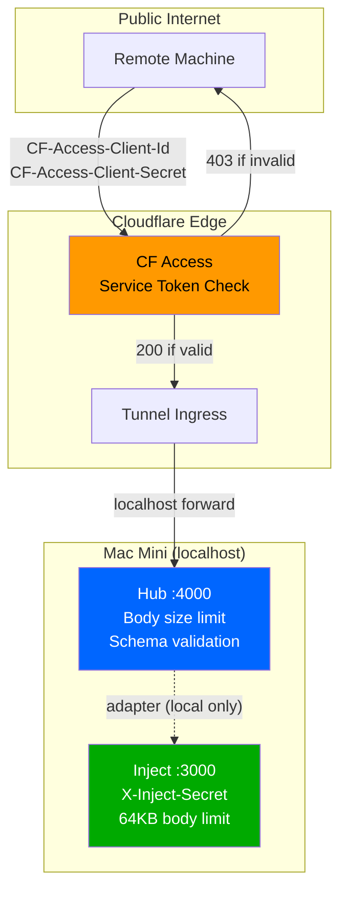

# Agent Bus — Session Brief (March 22, 2026)

## The Big Picture

We built **Agent Bus** in a single evening session — a complete event routing system that makes AI coding sessions visible in a 3D retro office (Claw3D). Every time Claude Code uses a tool, edits a file, or completes a task, the event flows through the bus and an agent appears working in the 3D world. Zero inference cost. Zero OpenClaw dependency. Runs anywhere via Cloudflare Tunnel.

The whole system costs $0/month — it uses your existing Mac Mini, a free Cloudflare Tunnel, and the Claude Max subscription you already have.



---

## The Problem We Solved

Claw3D only rendered agents from OpenClaw's gateway — meaning you needed OpenClaw running and spending API tokens. We wanted Claude Code sessions (which use Claude Max, no API cost) to appear in Claw3D without touching OpenClaw at all.

The solution: bypass the OpenClaw gateway entirely by injecting events directly into Claw3D's server. The adapter translates our events into Claw3D's native frame format and POSTs them to a new `/api/inject-event` endpoint we added to the Claw3D server.



---

## How It All Connects — The Event Journey

When you're coding with Claude Code and it runs the `Edit` tool on `auth.ts`, here's exactly what happens behind the scenes. The whole thing takes under 100ms:

1. Claude Code's PostToolUse hook fires (bash script, 1s timeout, never blocks)
2. The hook POSTs the event to the hub via Cloudflare Tunnel (encrypted, authenticated)
3. The hub validates the event, logs it to JSONL, and broadcasts to all WebSocket consumers
4. The adapter (a WS consumer) receives the event and translates it to a Claw3D frame
5. The adapter POSTs the frame to Claw3D's inject endpoint (shared secret auth)
6. Claw3D broadcasts the frame to all connected browsers
7. The 3D office animates — your agent sits at a desk, typing away



---

## What We Built — Phase by Phase

Everything was implemented, tested, reviewed, and committed in one session. Six phases, each with its own plan, tests, and code review.

**Phase 1 — Event Hub:** The core. A Node.js WebSocket + HTTP server that receives events via `POST /events`, validates the schema, broadcasts to all WS consumers, and appends to a JSONL log. Input validation includes body size limit (1MB), field length limits, and strict schema checking. 31 tests.

**Phase 2 — Claw3D Adapter:** Translates agent-bus events into Claw3D's native frame format. Maps `session_start` → agent lifecycle start, `tool_use` → chat delta, `task_complete` → chat final, `session_end` → lifecycle end. Generates deterministic IDs per agent/project. 39 tests.

**Phase 3 — Claude Code Hooks:** Bash scripts that fire on every tool use and session end. They POST to the hub with 1s timeout and fail silently — never blocking Claude Code. Support both local and remote (CF tunnel) access.

**Phase 4 — CLI-Anything:** A Python Click CLI following the CLI-Anything convention. Four commands: `publish`, `subscribe`, `replay`, `status`. Installed via `pip install -e .` as `cli-anything-agent-bus`. Includes SKILL.md for AI discoverability. 16 tests.

**Phase 5 — E2E Smoke Test:** Bash script that starts the hub, publishes 3 events (session_start → tool_use → session_end), checks the JSONL log, and verifies the health endpoint. 7 checks, all pass.

**Phase 6 — Inject Endpoint + CF Tunnel:** The big one. Added `POST /api/inject-event` to Claw3D's server (bypasses OpenClaw), rewrote the adapter from dual WS to simple HTTP POST, set up Cloudflare Tunnel with Access service tokens for secure remote access.

```mermaid
gantt
    title Implementation Timeline (1 session)
    dateFormat HH:mm
    axisFormat %H:%M

    section Phase 1
    Event Hub (hub + types + tests)     :done, p1, 23:12, 23:28

    section Phase 2
    Claw3D Adapter (translator + WS)    :done, p2, 23:28, 23:48

    section Phase 3
    Claude Code Hooks (scripts)         :done, p3, 23:48, 23:52

    section Phase 4
    CLI-Anything Harness (Python)       :done, p4, 23:52, 00:00

    section Phase 5
    E2E Smoke Test                      :done, p5, 00:00, 00:04

    section Phase 6
    Inject Endpoint + CF Tunnel         :done, p6, 00:22, 00:45

    section Infra
    CF Tunnel Deploy + Access Policy    :done, cf, 00:45, 01:10
```



---

## Testing — 93 Tests, Zero Failures

Every phase was tested by a dedicated tester agent, then reviewed by a code-reviewer agent. Critical findings were fixed before committing. The test-to-code ratio is 1.66:1 — more test code than production code.



---

## Security — Three Layers

Remote access is secured with three independent layers. Even if one is compromised, the others hold.

**Layer 1 — Cloudflare Access:** Remote machines must present valid service token headers (`CF-Access-Client-Id` + `CF-Access-Client-Secret`). Without them, Cloudflare returns 403 before the request ever reaches your Mac Mini.

**Layer 2 — Hub Validation:** The hub validates every event against a strict schema — required fields, field types, body size limit (1MB), field length limit (1024 chars). Malformed events are rejected with 400.

**Layer 3 — Inject Secret:** The Claw3D inject endpoint requires an `X-Inject-Secret` header. This is a local shared secret between the adapter and Claw3D — it never leaves the machine.



---

## Key Numbers

| Metric | Value |
|--------|-------|
| Total source LOC | 460 (TypeScript) + 258 (Python) = **718** |
| Test LOC | 914 (vitest) + 164 (pytest) + 117 (e2e) = **1,195** |
| Test:code ratio | **1.66:1** |
| Total tests | **93** |
| npm dependencies | **1** (ws) |
| Monthly cost | **$0** |
| Event latency | < 50ms (local), < 100ms (CF tunnel) |
| Max body size | 1MB (hub), 64KB (inject) |
| Code review score | **8.5/10** |

---

## Live Infrastructure

| Service | URL / Port | Status |
|---------|-----------|--------|
| Hub | `https://agent-bus.boxlab.cloud` | Live (CF Access protected) |
| Claw3D | `https://claw3d.boxlab.cloud` | Live (CF Access protected) |
| Hub local | `http://localhost:4000` | Running |
| CF Tunnel | LaunchAgent (auto-start) | Persistent |

---

## File Map

```
agent-bus/
├── src/
│   ├── hub/event-hub.ts          ← HTTP+WS server, JSONL, validation (166 LOC)
│   ├── adapter/claw3d-adapter.ts ← Hub WS → HTTP POST inject (83 LOC)
│   ├── adapter/event-translator.ts ← Event→Claw3D frame mapping (119 LOC)
│   ├── types/agent-event.ts      ← AgentEvent interface + validator (48 LOC)
│   ├── index.ts                  ← Hub entry point (20 LOC)
│   └── adapter/index.ts          ← Adapter entry point (24 LOC)
├── scripts/
│   ├── hook-post-tool-use.sh     ← Claude Code hook (CF auth)
│   ├── hook-session-event.sh     ← Session lifecycle hook
│   ├── setup-cloudflare-tunnel.sh ← Interactive CF setup
│   ├── e2e-smoke-test.sh         ← Full pipeline test
│   └── dev-all.js                ← Parallel launcher
├── cli-anything/agent-harness/   ← Python CLI (publish/subscribe/replay/status)
├── claw3d/                       ← Embedded Claw3D (gitignored, local mods)
├── tests/                        ← 70 vitest tests
├── docs/                         ← 7 documentation files
└── plans/                        ← Phase plans + research reports
```

---

## Endpoints & Environment

| Endpoint | Port | Auth | Purpose |
|----------|------|------|---------|
| `POST /events` | 4000 | CF Access (remote) / none (local) | Publish agent events |
| `GET /health` | 4000 | Same | Hub stats (clients, events) |
| `ws://localhost:4000` | 4000 | None (local) | WS event stream |
| `POST /api/inject-event` | 3000 | X-Inject-Secret header | Inject frames to browsers |

| Variable | Default | Used By |
|----------|---------|---------|
| `PORT` | 4000 | Hub |
| `LOG_DIR` | data | Hub |
| `INJECT_SECRET` | (required) | Adapter + Claw3D |
| `CLAW3D_INJECT_URL` | http://localhost:3000/api/inject-event | Adapter |
| `HUB_URL` | http://localhost:4000 | Hooks, CLI |
| `CF_CLIENT_ID` | (optional) | Remote hooks/CLI |
| `CF_CLIENT_SECRET` | (optional) | Remote hooks/CLI |

---

## Ideas for Tomorrow

### Quick Wins (30 min each)
- [ ] **LaunchAgent for the hub** — auto-start :4000 on login, like cloudflared
- [ ] **Install hooks on VPS + Windows PC** — first real live test with actual Claude sessions
- [ ] **Enhance dev:all** — start hub + adapter + claw3d together

### Medium Term (2-4 hours each)
- [ ] **Dashboard UI** — a web page showing live event stream, agent activity timeline
- [ ] **Log rotation** — cap events.jsonl at 10MB, auto-rotate old logs
- [ ] **Rate limiting** — prevent event flood from runaway hooks
- [ ] **Adapter mock tests** — unit test the WS→HTTP bridge with vitest mocks

### Bigger Ideas (full sessions)
- [ ] **Multi-agent visualization** — different Claude sessions = different agents walking around the 3D office, each at their own desk
- [ ] **Agent "mood" detection** — infer activity from event patterns (lots of Edit = busy coding, lots of Read = researching, Bash = deploying)
- [ ] **Replay mode** — play back a recorded session in Claw3D like a time-lapse video
- [ ] **Webhook integrations** — Slack/Discord notifications on session_start/end
- [ ] **NATS/Redis transport** — for high-throughput multi-team scenarios

---

## Commits This Session

```
9d91ab0 docs: comprehensive update — all 6 phases, CF tunnel, roadmap
f94d8a7 feat: phase 6 — inject endpoint, adapter HTTP mode, CF tunnel
c003ce5 fix: audit findings — JSON injection, double-resolve, engines
89d5a1e docs: phases 3-5 completion
d2a1892 feat: E2E smoke test (phase 5)
99aec30 feat: CLI-Anything harness (phase 4)
c1ea038 feat: Claude Code hooks (phase 3)
544d0ed feat: Claw3D adapter (phase 2)
cd67eb8 feat: event hub (phase 1)
```

---

**Repo:** https://github.com/emiliovos/agent-bus (private)
**Hub:** https://agent-bus.boxlab.cloud (CF Access protected)
**Claw3D:** https://claw3d.boxlab.cloud (CF Access protected)
