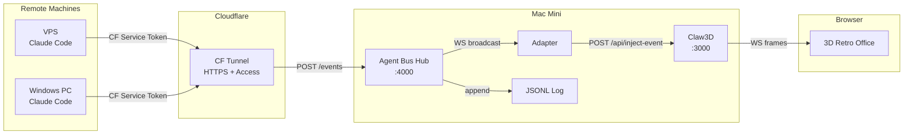
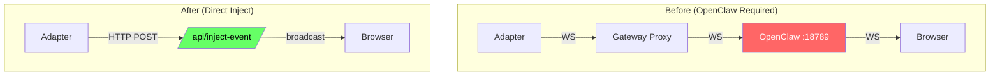
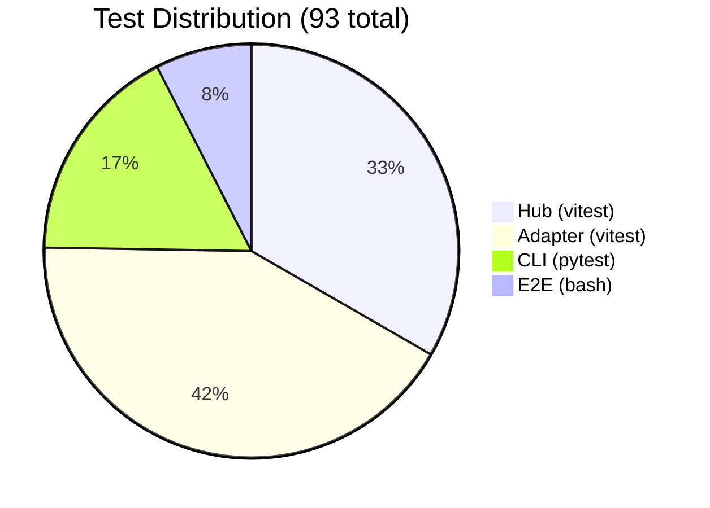
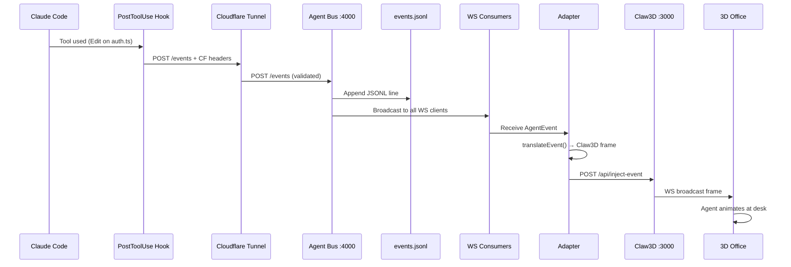
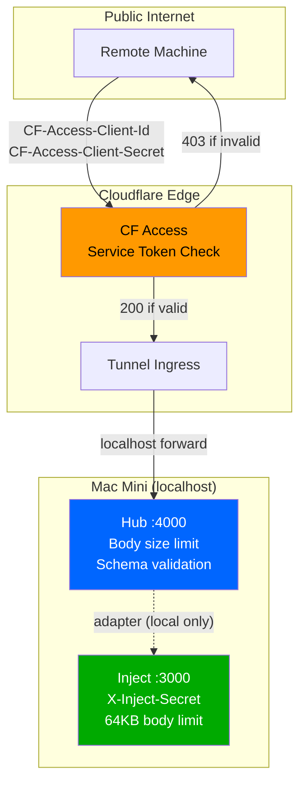

# Agent Bus — Session Brief (March 22, 2026)

## What We Built Tonight

A complete event routing system that makes AI coding sessions visible in a 3D office — zero cost, zero OpenClaw dependency.



## Architecture Decision: Why No OpenClaw



**Result:** Removed OpenClaw gateway dependency entirely. Adapter POSTs directly to Claw3D server. Shared secret auth instead of gateway token.

## Phase Timeline

```mermaid
gantt
    title Implementation Timeline (1 session)
    dateFormat HH:mm
    axisFormat %H:%M

    section Phase 1
    Event Hub (hub + types + tests)     :done, p1, 23:12, 23:28

    section Phase 2
    Claw3D Adapter (translator + WS)    :done, p2, 23:28, 23:48

    section Phase 3
    Claude Code Hooks (scripts)         :done, p3, 23:48, 23:52

    section Phase 4
    CLI-Anything Harness (Python)       :done, p4, 23:52, 00:00

    section Phase 5
    E2E Smoke Test                      :done, p5, 00:00, 00:04

    section Phase 6
    Inject Endpoint + CF Tunnel         :done, p6, 00:22, 00:45

    section Infra
    CF Tunnel Deploy + Access Policy    :done, cf, 00:45, 01:10
```



## Test Coverage



## Event Flow — What Happens When You Use a Tool



## Key Numbers

| Metric | Value |
|--------|-------|
| Total source LOC | 460 (TypeScript) + 258 (Python) = 718 |
| Test LOC | 914 (vitest) + 164 (pytest) + 117 (e2e) = 1,195 |
| Test:code ratio | 1.66:1 |
| Total tests | 93 |
| npm dependencies | 1 (ws) |
| Monthly cost | $0 |
| Event latency | < 50ms (local), < 100ms (CF tunnel) |
| Max body size | 1MB (hub), 64KB (inject) |

## File Map

```
agent-bus/
├── src/
│   ├── hub/event-hub.ts          ← HTTP+WS server, JSONL, validation (166 LOC)
│   ├── adapter/claw3d-adapter.ts ← Hub WS → HTTP POST inject (83 LOC)
│   ├── adapter/event-translator.ts ← Event→Claw3D frame mapping (119 LOC)
│   ├── types/agent-event.ts      ← AgentEvent interface + validator (48 LOC)
│   ├── index.ts                  ← Hub entry point (20 LOC)
│   └── adapter/index.ts          ← Adapter entry point (24 LOC)
├── scripts/
│   ├── hook-post-tool-use.sh     ← Claude Code hook (CF auth)
│   ├── hook-session-event.sh     ← Session lifecycle hook
│   ├── setup-cloudflare-tunnel.sh ← Interactive CF setup
│   ├── e2e-smoke-test.sh         ← Full pipeline test
│   └── dev-all.js                ← Parallel launcher
├── cli-anything/agent-harness/   ← Python CLI (publish/subscribe/replay/status)
├── claw3d/                       ← Embedded Claw3D (gitignored, local mods)
├── tests/                        ← 70 vitest tests
├── docs/                         ← 7 documentation files
└── plans/                        ← Phase plans + research reports
```

## Security Model



## Endpoints

| Endpoint | Port | Auth | Purpose |
|----------|------|------|---------|
| `POST /events` | 4000 | CF Access (remote) / none (local) | Publish agent events |
| `GET /health` | 4000 | Same | Hub stats |
| `ws://localhost:4000` | 4000 | None (local) | WS event stream |
| `POST /api/inject-event` | 3000 | X-Inject-Secret header | Inject frames to browsers |

## Environment Variables

| Variable | Default | Where |
|----------|---------|-------|
| `PORT` | 4000 | Hub |
| `LOG_DIR` | data | Hub |
| `INJECT_SECRET` | (required) | Adapter + Claw3D |
| `CLAW3D_INJECT_URL` | http://localhost:3000/api/inject-event | Adapter |
| `HUB_URL` | http://localhost:4000 | Hooks, CLI |
| `CF_CLIENT_ID` | (optional) | Remote hooks/CLI |
| `CF_CLIENT_SECRET` | (optional) | Remote hooks/CLI |

## Ideas for Tomorrow

### Quick Wins
- [ ] LaunchAgent for the hub itself (auto-start :4000 on login)
- [ ] Install hooks on VPS + Windows PC → first real live test
- [ ] `npm run dev:all` to also start the adapter

### Medium Term
- [ ] Dashboard UI — web page showing live event stream
- [ ] Log rotation — cap events.jsonl at 10MB, rotate
- [ ] Rate limiting — prevent event flood
- [ ] Adapter WS unit tests with mocks

### Bigger Ideas
- [ ] Multi-agent visualization — different Claude sessions = different agents walking in office
- [ ] Agent "mood" from event patterns (lots of Edit = busy, lots of Read = researching)
- [ ] Replay mode — play back a session in Claw3D like a recording
- [ ] Webhook integrations — Slack/Discord notifications on session_start/end
- [ ] NATS/Redis transport for high-throughput scenarios

## Commits This Session

```
9d91ab0 docs: comprehensive update — all 6 phases, CF tunnel, roadmap
f94d8a7 feat: phase 6 — inject endpoint, adapter HTTP mode, CF tunnel
c003ce5 fix: audit findings — JSON injection, double-resolve, engines
89d5a1e docs: phases 3-5 completion
d2a1892 feat: E2E smoke test (phase 5)
99aec30 feat: CLI-Anything harness (phase 4)
c1ea038 feat: Claude Code hooks (phase 3)
544d0ed feat: Claw3D adapter (phase 2)
cd67eb8 feat: event hub (phase 1)
```

**Repo:** https://github.com/emiliovos/agent-bus (private)
**Tunnel:** https://agent-bus.boxlab.cloud (CF Access protected)
